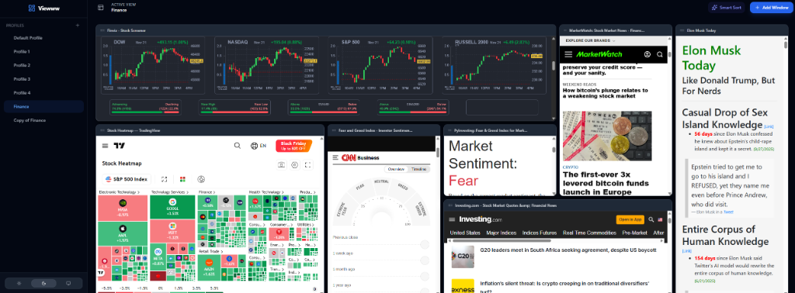

# Viewww




Viewww is a powerful, multi-view browser dashboard that allows you to manage and view multiple websites simultaneously in a customizable grid layout.

## Features

- **Multi-Window Browsing**: Open and interact with multiple websites in a single tab.
- **Smart Layouts**: Automatically organize windows with "Smart Sort" or customize your workspace with draggable and resizable frames.
- **Profile Management**: Create, edit, duplicate, and delete profiles to switch between different workspace setups instantly.
- **Proxy Support**: Built-in proxy server to bypass iframe restrictions (X-Frame-Options), ensuring compatibility with most websites.
- **Mobile Responsive**: Optimized for all devices with a responsive sidebar and touch-friendly controls.
- **Persistent State**: Your windows, layouts, and scroll positions are automatically saved.

## Tech Stack

- **Frontend**: React, TypeScript, Vite, Tailwind CSS
- **State Management**: Zustand
- **Backend**: Node.js, Express (for Proxy Server)
- **Icons**: Lucide React

## Getting Started

### Prerequisites

- Node.js (v18 or higher recommended)
- npm or yarn

### Installation

1. Clone the repository:
   ```bash
   git clone <repository-url>
   cd viewww
   ```

2. Install dependencies:
   ```bash
   npm install
   ```

### Running the Application

To run Viewww, you need to start both the frontend development server and the proxy server.

1. Start the Proxy Server (required for loading websites):
   ```bash
   npm run proxy
   ```

2. Start the Frontend:
   ```bash
   npm run dev
   ```

3. Open your browser and navigate to `http://localhost:5173` (or the URL shown in your terminal).

## Usage

- **Add Window**: Enter a URL in the sidebar input and click "+" to add a new window.
- **Manage Profiles**: Use the sidebar to switch between profiles or create new ones.
- **Customize Layout**: Drag and resize windows to arrange them to your liking.
- **Smart Sort**: Click the "Smart Sort" button to automatically arrange windows in a grid.

## Troubleshooting

- **Websites not loading**: Ensure the proxy server is running (`npm run proxy`). Some websites may still block being embedded even with the proxy.
- **Proxy Error**: If you see proxy errors, check your terminal for any error messages from the proxy server.
- **Port in use**: If you cannot start the server, make sure ports 5173 (frontend) and 3000 (proxy) are not in use.
